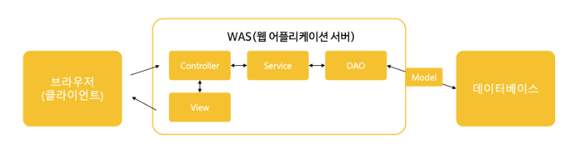

### Transactional은 무엇일까?

Spring의 웹 구조는 다음과 같다.

1) 웹사이트 URL로 접근하여 정보를 요청합니다.
2) `Controller`에서 요청 정보를 받고 `Service`를 호출합니다.
3) `Service`에서 `DAO`를 호출하여 데이터베이스에 접근합니다.
4) `Service`의 작업이 완료된 후 `Service`를 호출했던 `Controller`로 다시 돌아옵니다.
5) `Controller` 데이터를 `View`에 전달합니다.
6) `View`에서 사용자에게 최종적으로 보여줄 화면을 만듭니다.

 
 출처 

- https://velog.io/@909snare/%EC%8A%A4%ED%94%84%EB%A7%81-MVC-%EA%B8%B0%EB%B0%98%EC%9D%98-%EC%9B%B9-%ED%94%84%EB%A1%9C%EA%B7%B8%EB%9E%98%EB%B0%8D-%EA%B5%AC%EC%A1%B0  
- https://it-sunny-333.tistory.com/129  

